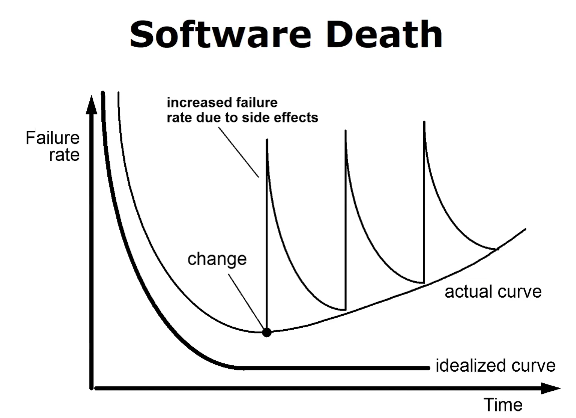
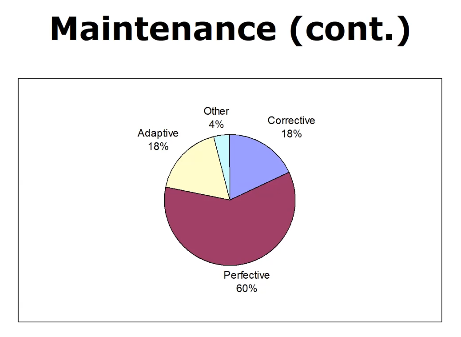
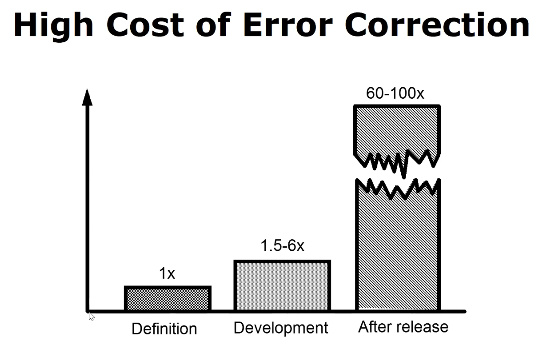
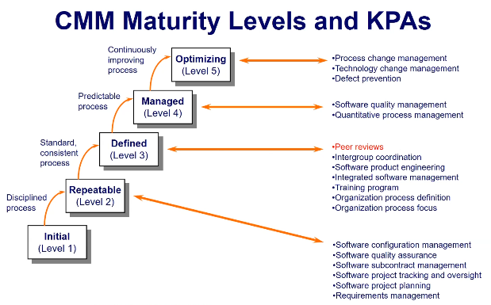
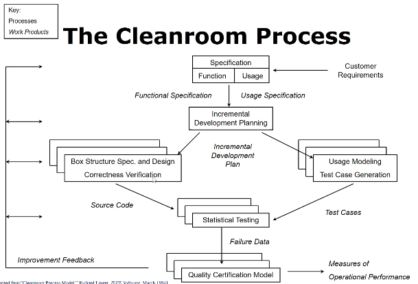
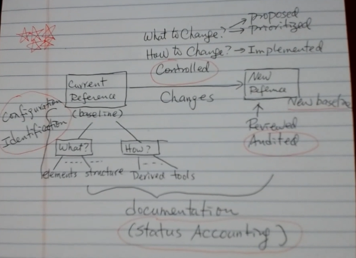

# SQA Test 1

### Notes

- Most development is perfective - See [Fig2](#fig2)
- 60/60 rule - 60% of development is maintenance, 60 percent of that is perfective/enhancement
- One of the two most common causes of runaway projects is unstable requirements 
-  Rigorous reviews commonly remove up to 90% of errors from software before the first test case
- reviews are more effective and cost effective error-removal strategy, including testing. but cannot and should not replace testing
- Peer review has widely recognized in the industry as the single most important factor in detecting and preventing defects in software products
- Correctness verification - use peer review to ensure that there are no bugs - see [Fig5](#fig5)
- 70% of software organizations are stuck in the first two levels of SEIs scale of sophistication
- cleanroom is intolerant of creativity, the individual coding flourishes and styles are the signature of all the night software world. - Do exactly what the manual says
- Failure is erroneous/unexpected runtime behavior observed by a user
- Fault is a static software characteristic that can cause a failure to occur
  - the presence of a fault doesn't imply the occurrence of a failure
- A removal of X% of faults does mean an X% improvement in reliability
- Pareto Principle
  - 80%  of failures can be traced to 20% of faults
  - High execution probability -> vital few
- Code review
  - two types
    - Coordinated - Assignments based on usage scenario - no gaps
    - Uncoordinated - Choose your preferences - gaps
- Changes are inevitable in software products
- Configuration Management see [Fig6](#fig6)
- Baseline - A software product that has *been formally reviewed and agreed upon*, that thereafter serves as the basis for further development, and that can be changed only through formal change control procedures
- Exploratory testing - Without a specification you are not testing but merely exploring the system

### Charts and Figures

#### Fig1

#### Fig2

#### Fig3

#### Fig4

#### Fig5

#### Fig6

